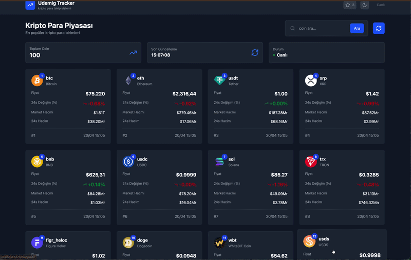
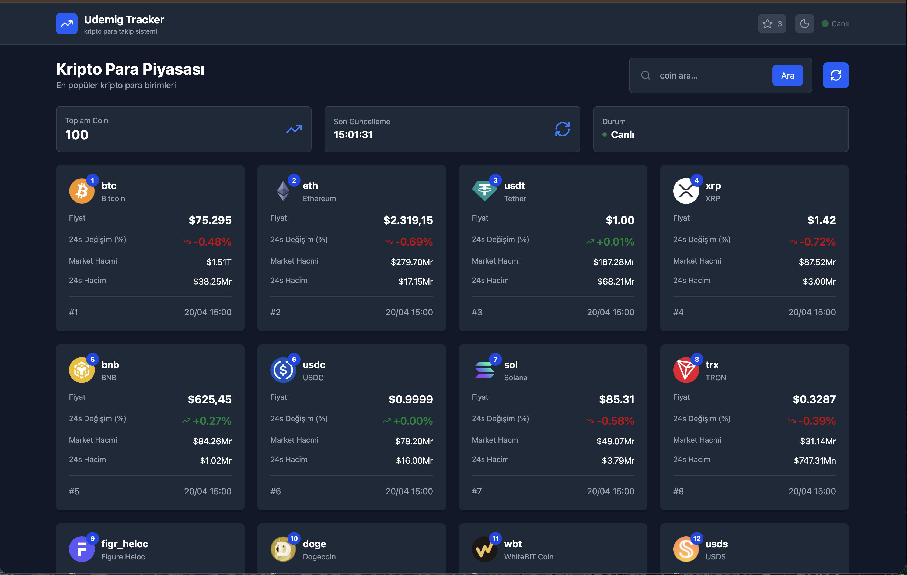
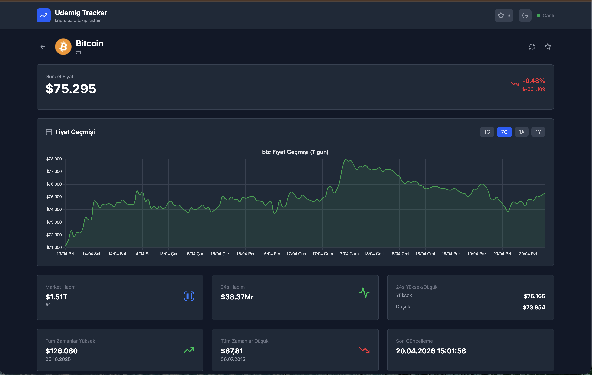
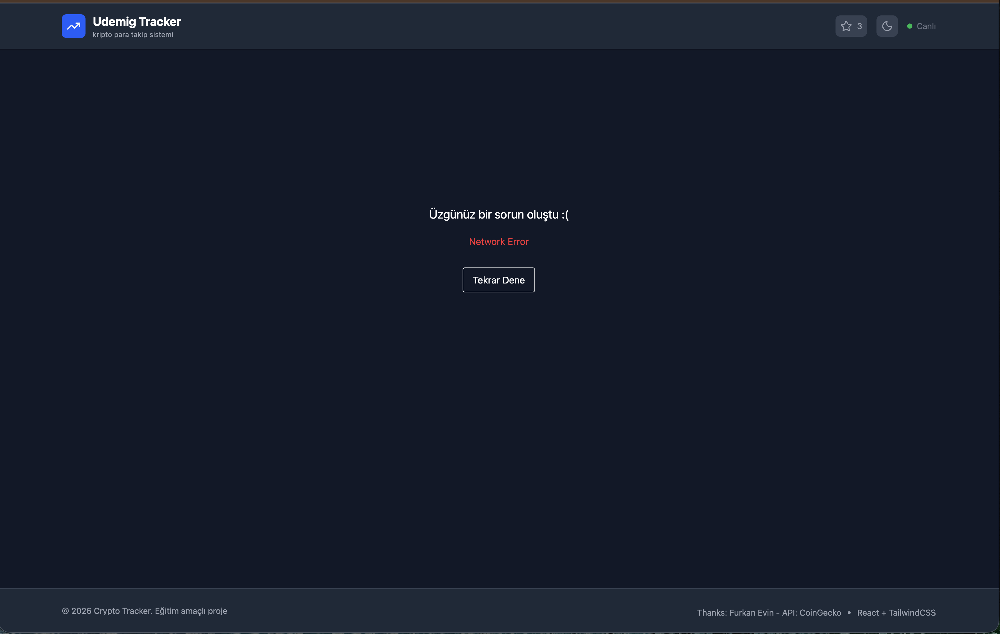

                   # React + Vite
# 💰 Crypto Tracker (React + Vite)

A modern cryptocurrency tracking application built with React and Vite.  
This project focuses on real-time data visualization, performance, and clean UI design.

---

## 🚀 Overview

Crypto Tracker allows users to monitor cryptocurrency prices, analyze trends, and explore market data in a fast and responsive interface.

The application is designed to simulate real-world financial dashboards with a modern user experience.

---

## 🧠 Features

- 📊 Live cryptocurrency data tracking  
- 🔍 Search and filter functionality  
- ⚡ Fast performance with Vite  
- 📱 Fully responsive design  
- 🧩 Component-based architecture (React)  
- 📈 Clean and intuitive dashboard UI  

---

## 🖥️ Dashboard Preview

A structured and user-friendly dashboard displaying key crypto data.

---

## 📊 Market View

Detailed market listing with dynamic updates and filtering.

---

## 📈 Analytics View

Clear visualization of trends and price movements.

---

## 🖥️ Fullscreen Experience

Optimized layout for a more immersive tracking experience.

---

## 🛠️ Tech Stack

- ⚛️ React  
- ⚡ Vite  
- 🎨 CSS3  
- 📜 JavaScript (ES6+)  

---

## ⚙️ Installation & Run

git clone https://github.com/yourusername/crypto-tracker.git  
cd crypto-tracker  
npm install  
npm run dev  

---

## 📌 Highlights

- Real-world crypto dashboard experience  
- Clean and scalable frontend structure  
- Optimized performance with Vite  
- Modern UI focused on usability  

---

## 👨‍💻 Author

Numan Balık

---

## 🙏 Acknowledgment

Special thanks to my instructor **Mehmet Can Seyhan**, ** furkan evin** and the **Udemig** team for their support.
